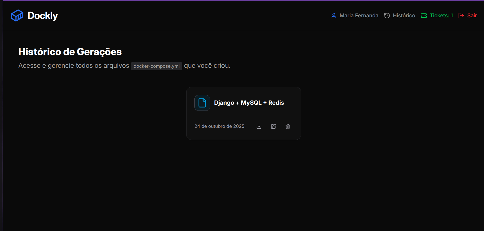

# 🐳 Dockly

**Dockly** é um gerador de ambientes Docker que cria automaticamente seu `docker-compose.yml` a partir de um simples prompt de texto.  
Escreva o stack que você deseja e o Dockly monta o ambiente completo pra você em segundos. 

> 🚀 *Pare de decorar configurações. Comece a gerar ambientes.*
---

## ✨ Funcionalidades
- 🧠 **Geração automática de docker-compose.yml** com base em prompts de texto.
- ⚙️ **Stacks populares** prontas para uso: Node.js, React, Python, Redis, etc.
---

## Exemplo de Uso
- "Preciso de um ambiente React + Node.js + MongoDB"
- O Dockly retorna:

## Interface
## Login

## Cadastrar

## Dashboard

## Histórico

## Planos

## Como funciona?
### Quando você se cadastra, você recebe 3 tickets para testar e usar como quiser.
### Gere seus primeiros arquivos `docker-compose.yml`.
### Recarregue seus tickets quando acabar clicando em "Tickets".
